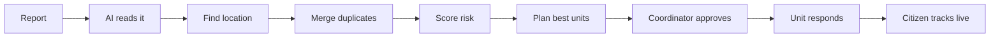
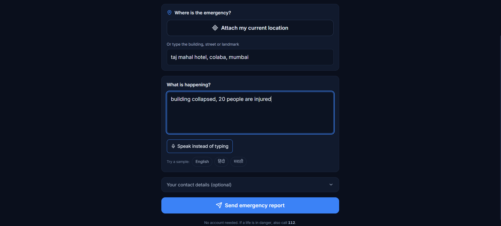
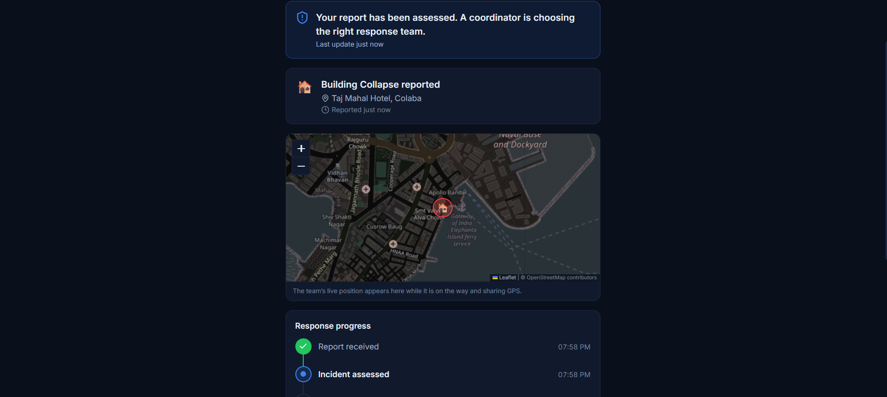
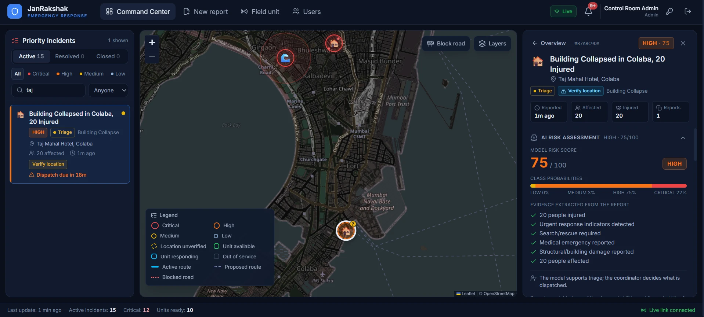
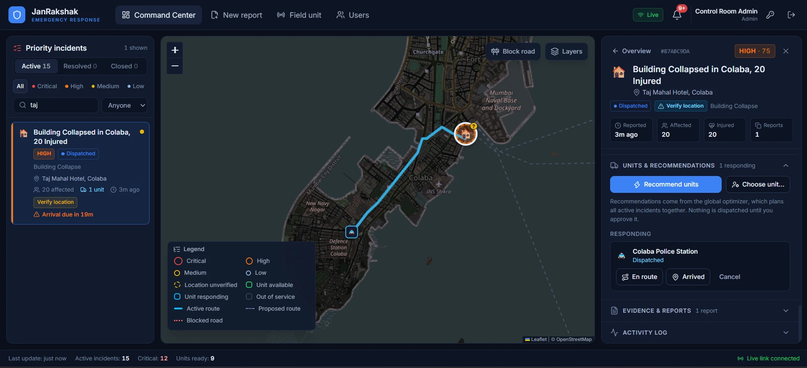

<div align="center">

# JanRakshak

**Smart emergency response for cities**

Turns emergency reports into clear priorities and sends the right help, faster.


</div>

---

## Why JanRakshak?

During an emergency, reports pour in from many people, in different languages, often with unclear locations. The same incident gets reported again and again, and coordinators have only minutes to decide where each ambulance or fire truck should go.

**JanRakshak helps them decide quickly and fairly, while a human always makes the final call.**

---

## What it does

- **Understands any report:** English, Hindi or Marathi, typed or spoken. AI pulls out the key facts.
- **Scores the risk:** a trained machine-learning model rates each incident from Low to Critical.
- **Finds the exact place:** resolves vague locations, uses GPS, and flags anything uncertain.
- **Avoids duplicates:** many reports of the same fire become one incident.
- **Sends the right units:** plans all incidents together, so critical ones get help first.
- **Uses real roads:** travel times come from road maps, and blocked roads are avoided.
- **Adapts live:** re-plans when a road closes or a new emergency appears.
- **Keeps humans in charge:** every dispatch needs a coordinator's approval.
- **Keeps citizens informed:** anyone can report without logging in and track the response live.

---

## How it works



---

## Screenshots

### Citizen side

<table>
  <tr>
    <td width="50%" align="center"><b>Report an emergency</b><br/><sub>No login. Attach GPS or type a landmark, describe what's happening in any language.</sub></td>
    <td width="50%" align="center"><b>Track the response live</b><br/><sub>Short tracking ID, live status, map and step-by-step progress.</sub></td>
  </tr>
  <tr>
    <td></td>
    <td></td>
  </tr>
</table>

### Command Center (coordinator)

**AI risk assessment:** the report becomes a prioritised incident. The ML model scores the risk (here HIGH, 75/100) from the extracted evidence, and an uncertain location is flagged for verification.



**Dispatch and live route:** after the coordinator approves a unit, its real road route appears on the map, and the citizen's tracking page updates instantly.



---

## Results

Compared with simply sending the nearest unit to each incident, in a 10-incident test:

|  | Before | JanRakshak |
|---|:---:|:---:|
| Incidents fully covered | 38% | **83%** |
| Same unit sent to two places | 16 times | **0** |
| Wrong type of unit sent | 4 times | **0** |

*From a synthetic Mumbai benchmark (`npm run bench:allocation`).*

---

## Quick start

You need **Node.js 20+**.

```bash
git clone https://github.com/aditya-pallerla/JanRakshak-AI_Assisted_Emergency_Response_and_Resource_Coordination
cd JanRakshak-AI_Assisted_Emergency_Response_and_Resource_Coordination
npm install
cp .env.example .env
npm run dev
```

Open **http://localhost:5173** and sign in with a demo account:

| Role | Username | Password |
|---|---|---|
| Coordinator | `coordinator` | `Coord@12345` |
| Admin | `admin` | `Admin@12345` |
| Field unit | `field` | `Field@12345` |

The citizen pages need no login: `/public-report` and `/track/:id`.

> **Optional:** add a `GEMINI_API_KEY` to `.env` for AI report reading. Without it, a simpler built-in classifier is used.

---

## Built with

| Part | Tools |
|---|---|
| Frontend | React, TypeScript, Tailwind CSS, Leaflet maps |
| Backend | Node.js, Express, Socket.IO (live updates) |
| Database | PostgreSQL (embedded with PGlite, no setup needed) |
| AI & ML | Google Gemini, XGBoost |
| Maps & routes | OpenStreetMap, OSRM |

---

## Project structure

```
src/        Frontend: pages and components
server/     Backend: API, AI, risk model, allocation engine
```

Full technical details are in **[JANRAKSHAK_PROJECT_DOCUMENTATION.md](JANRAKSHAK_PROJECT_DOCUMENTATION.md)**.

---

## Good to know


- Public map and routing servers have usage limits; self-host them for real use.

---

## Team

- Aditya Pallerla
- Avishkar Padwal
- Om Hojage
- Sohan Pangale

<div align="center">


</div>
